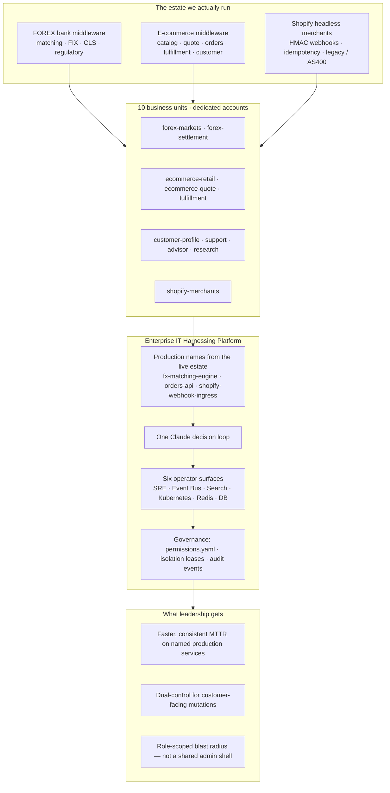
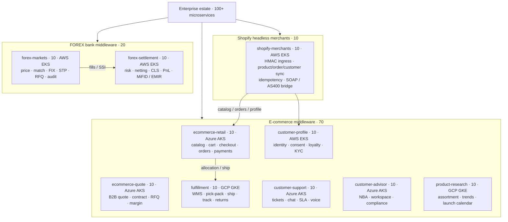
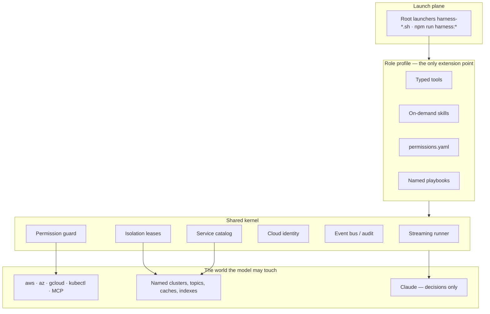
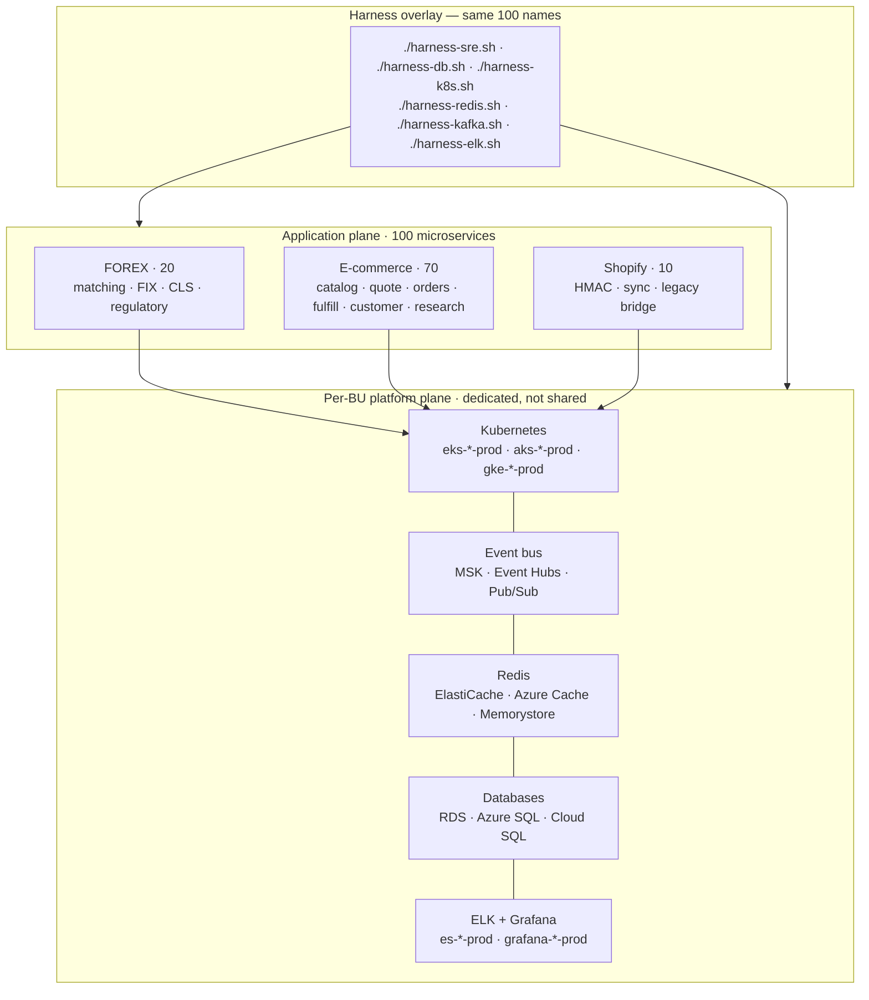
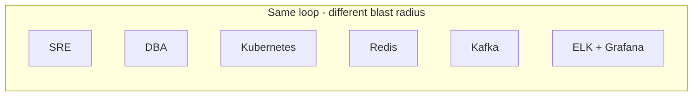

# claude-code-enterprise-it-harnessing

[](https://github.com/javakishore-veleti/claude-code-enterprise-it-harnessing/stargazers)
[](https://github.com/javakishore-veleti/claude-code-enterprise-it-harnessing/network/members)
[](https://github.com/javakishore-veleti/claude-code-enterprise-it-harnessing/issues)
[](https://github.com/javakishore-veleti/claude-code-enterprise-it-harnessing/commits/main)
[](LICENSE)

[](pyproject.toml)
[](https://docs.astral.sh/uv/)
[](https://github.com/anthropics/anthropic-sdk-python)
[](https://modelcontextprotocol.io/)
[](https://redis.io/)
[](https://pyyaml.org/)
[](package.json)

## Table of Contents

- [Introduction](#introduction)
  - [Enterprise context](#enterprise-context)
    - [Domains and business functions](#domains-and-business-functions)
  - [Current Enterprise IT State](#current-enterprise-it-state)
  - [What the `enterprise_it_harnessing` folder is](#what-the-enterprise_it_harnessing-folder-is)
- [Purpose, objective, value, and business impact](#purpose-objective-value-and-business-impact)
- [How To Use](#how-to-use)
- [Strategic diagram](#strategic-diagram-svp-of-engineering)
- [Enterprise architecture](#enterprise-architecture--domains-summing-to-100-microservices)
- [The estate](#the-estate)
- [Operator profiles](#operator-profiles)
- [Platform capabilities](#platform-capabilities)
- [Architecture for Engineering Managers and Chief Architects](#architecture-for-engineering-managers-and-chief-architects)
- [Role-specific diagrams](#role-specific-diagrams)
- [How to launch from the repository root](#how-to-launch-from-the-repository-root)
- [What is Harness Engineering?](#what-is-harness-engineering)
- [How Claude Code Uses Harness Engineering?](#how-claude-code-uses-harness-engineering)
  - [Phase 1: The Core Agent Loop](#phase-1-the-core-agent-loop)
  - [Phase 2: Knowledge & Context Management](#phase-2-knowledge--context-management)
  - [Phase 3: Async Execution & Multi-Agent Teams](#phase-3-async-execution--multi-agent-teams)
- [Session guide](#session-guide)
- [Enterprise IT Harnessing](enterprise_it_harnessing/README.md)
- [Full diagram set](docs/platform-diagrams.md)

## Introduction

This repository is an **Enterprise IT Harnessing Platform**. One decision loop. Six operator surfaces — SRE, Event Bus (Kafka), Search (ELK), Kubernetes, Redis, and DB.

### Enterprise context

The Enterprise IT team is in the business of supporting the domains below. Those domains are deployed and managed on the six operator surfaces — SRE, Event Bus, Search, Kubernetes, Redis, and DB.

#### Domains and business functions

| Domain | Core business functions |
| --- | --- |
| **FOREX bank middleware** | Price ingest, matching, FIX sessions, STP to bank venues, trade capture, RFQ, risk / credit limits, multilateral netting, CLS settlement, PnL, margin, MiFID / EMIR reporting |
| **E-commerce microservices** | Product catalog, list / promo / contract pricing, cart, checkout saga, orders, payments, inventory reservation, B2B quote-to-order, fulfillment (WMS, pick-pack, ship, track, returns), customer profile / consent / loyalty, support tickets and SLA, advisor next-best-action, product research and assortment — full tech stack and SRE practices |
| **Shopify headless merchants** | Merchant OAuth, HMAC-verified webhooks, product / inventory / order / customer sync into catalog and ERP, idempotency, fulfillment push-back, SOAP / AS/400 legacy bridge |

FOREX matching and settlement, e-commerce checkout and fulfillment, and Shopify headless integration do not share a single admin shell, but they share one operational problem: dedicated cloud accounts, many stacks, and production changes that must stay inside a role. Such an Enterprise IT organization needs **unified IT Harnessing** — one loop, one permission engine, six role-scoped surfaces. This repository is a foundation and a reference implementation for that need.

### Current Enterprise IT State

This repository does **not** contain 100 microservice codebases. Those applications already run in production. The current Enterprise IT estate this harness is built against is **10 business units** on dedicated cloud accounts, operating FOREX bank middleware, e-commerce middleware, and Shopify headless merchant integration — on the order of **100 microservices** deployed outside this repo. Operators resolve production names such as `fx-matching-engine`, `orders-api`, and `shopify-webhook-ingress` so the model works the estate the company already runs, not a fictional `service-1`.

> **NOTE.** The Claude Code Python scripts at the root of this repo (`s01_…` through `s23_…`) are **foundational harnessing capabilities** — hello-world through advanced (skills, permissions, teams, MCP, worktrees). They teach the loop. They are not the product.

### What the `enterprise_it_harnessing` folder is

[`enterprise_it_harnessing/`](enterprise_it_harnessing/README.md) is the **actual product of this git repository**. It is what Enterprise IT Harnessing should always be: six role-scoped operator surfaces (SRE, Event Bus, Search, Kubernetes, Redis, DB) over a live production estate, with declarative permissions, isolation leases, and root launchers (`./harness-sre.sh` and the rest). The `s01`–`s23` scripts stay at the root as the teaching layer. Day-to-day operators start here — see [How to launch](#how-to-launch-from-the-repository-root).

[Strategic diagram (SVP)](#strategic-diagram-svp-of-engineering) · [Purpose, objective, value, and business impact](#purpose-objective-value-and-business-impact) · [How To Use](#how-to-use) · [Full diagram set](docs/platform-diagrams.md)

## Purpose, objective, value, and business impact

Enterprise IT Harnessing is the control plane around the model, not another chatbot on a shared admin shell. This repo ships a Claude Code loop so the platform is runnable on day one. The **purpose, objective, value, and impact** below are properties of the harness — they survive if you replace Claude with another framework.

| | What it means for this estate |
| --- | --- |
| **Purpose** | Give each operator role a **permissioned surface** over the production estate they already run — FOREX matching / FIX / CLS, checkout and fulfillment, Shopify HMAC and legacy bridge — without handing anyone a generic `bash` on production. |
| **Objective** | One loop, six profiles (SRE, Event Bus, Search, Kubernetes, Redis, DB), a catalog that resolves real names, and a guard that **denies**, **allows**, or **asks** before every tool. Cloud identity is argv. Mutations take an isolation lease. |
| **Value** | Operators work the way they already think: `./harness-sre.sh observe-fx-matching`, not “ask the model to kubectl.” Skills load on demand. Catalog dumps do not spend tokens. Playbooks do. The same harness runs on AWS, Azure, and GCP. |
| **Business impact** | Faster, **repeatable MTTR** on named SLOs. Dual-control for rollback, failover, silence, and ACL change. Irreversible wipes (`FLUSHALL`, `DROP DATABASE`, namespace delete) cannot be “reasoned through.” Two agents cannot mutate the same cluster, topic, or cache at once. Blast radius stays inside the business unit that owns the account. |

**Framework note.** Claude Code is the default decision engine because this repo reconstructs that harness. Customizing to another framework means replacing the streaming client and keeping everything else: `permissions.yaml`, isolation leases, the 10-BU catalog, on-demand skills, MCP, and the root `./harness-*.sh` launchers. Do not port the deny rules into prompt text. They belong in the harness.

## How To Use

[HowToUse.md](HowToUse.md) — pick your role, then run the commands.

| If you are | Catalog / playbooks | Jobs |
| --- | --- | --- |
| SRE | [HowToUse_SRE.md](HowToUse_SRE.md) | [HowToUse_SRE_Jobs.md](HowToUse_SRE_Jobs.md) · `./harness-sre-job.sh` |
| DB | [HowToUse_DB.md](HowToUse_DB.md) | [HowToUse_DB_Jobs.md](HowToUse_DB_Jobs.md) · `./harness-db-job.sh` |
| Kubernetes | [HowToUse_K8s.md](HowToUse_K8s.md) | [HowToUse_K8s_Jobs.md](HowToUse_K8s_Jobs.md) · `./harness-k8s-job.sh` |
| Redis | [HowToUse_Redis.md](HowToUse_Redis.md) | [HowToUse_Redis_Jobs.md](HowToUse_Redis_Jobs.md) · `./harness-redis-job.sh` |
| Kafka / Event Bus | [HowToUse_Kafka.md](HowToUse_Kafka.md) | [HowToUse_Kafka_Jobs.md](HowToUse_Kafka_Jobs.md) · `./harness-kafka-job.sh` |
| ELK / Search | [HowToUse_ELK.md](HowToUse_ELK.md) | [HowToUse_ELK_Jobs.md](HowToUse_ELK_Jobs.md) · `./harness-elk-job.sh` |

## Strategic diagram (SVP of Engineering)

[Full diagram set — SVP, Engineering Manager / Chief Architect, and every operator role](docs/platform-diagrams.md)



### Enterprise architecture — domains summing to 100+ microservices

Three product domains. Ten dedicated business units. Ten named services per unit. **100 microservices**, plus the per-BU data plane (cluster, bus, cache, database, ELK) that those services sit on.



| Domain | Business units | Services | Sum |
| --- | --- | --- | --- |
| FOREX bank middleware | `forex-markets`, `forex-settlement` | 10 + 10 | **20** |
| E-commerce middleware | retail, quote, fulfillment, profile, support, advisor, research | 10 × 7 | **70** |
| Shopify headless merchants | `shopify-merchants` | 10 | **10** |
| **Enterprise** | **10 BUs** | | **100+** |

**[Architecture (EM / Chief Architect)](#architecture-for-engineering-managers-and-chief-architects)** · **[Role diagrams](#role-specific-diagrams)** · **[Full diagram set](docs/platform-diagrams.md)**

## The estate

Three product domains share the same harnessing folders. Each business unit owns a dedicated cloud account and its own Kubernetes, Kafka / Event Hubs / Pub/Sub, Redis, Elasticsearch, and Grafana stack.

| Domain | What it is | Typical services |
| --- | --- | --- |
| **FOREX trade-processing middleware (banks)** | Price, match, route, capture, FIX, STP, then risk / netting / CLS / regulatory | `fx-matching-engine`, `fx-fix-gateway`, `fx-cls-adapter`, `fx-regulatory-report` |
| **E-commerce middleware (microservices)** | Product catalog, quote, orders, shipping, fulfillment, customer profile, support, advisor, product research | `catalog-api`, `quote-api`, `orders-api`, `checkout-orchestrator`, `tracking-api`, `ticket-api`, `advisor-workspace` |
| **Shopify headless merchants** | Shopify data into legacy and on-prem systems; HMAC webhooks; idempotency; SOAP / AS/400 bridge | `shopify-webhook-ingress`, `shopify-order-sync`, `shopify-legacy-bridge`, `shopify-idempotency` |

Call `list_business_units`, `list_services`, or `resolve_service` before guessing an account or cluster. The full BU table lives in [`enterprise_it_harnessing/README.md`](enterprise_it_harnessing/README.md).

## Operator profiles

| Role | What the harness is allowed to do | What stays denied or dual-control | Launcher |
| --- | --- | --- | --- |
| **SRE** | Observe named SLOs, fetch logs, run incident loops for matching-engine / checkout / Shopify HMAC | Rollback and paging require an operator; namespace wipe is denied | [`./harness-sre.sh`](harness-sre.sh) · [sre.md](enterprise_it_harnessing/sre.md) |
| **DB admin (AWS, Azure, GCP)** | Describe instances, explain slow queries, list snapshots across RDS, Aurora, Azure SQL, Cloud SQL, Spanner | Failover / restore require approval; `DROP DATABASE` is denied | [`./harness-db.sh`](harness-db.sh) · [db.md](enterprise_it_harnessing/db.md) |
| **Kubernetes (EKS, AKS, GKE, on-prem)** | `get` / `describe` / `logs` scoped to the BU kubeconfig | Drain, scale, and rollout undo require approval; namespace / PV delete is denied | [`./harness-k8s.sh`](harness-k8s.sh) · [k8s.md](enterprise_it_harnessing/k8s.md) |
| **Redis (ElastiCache, Azure Cache, Memorystore)** | `INFO`, slowlog, replica lag, eviction / hot-key skills | Failover and ACL changes require approval; `FLUSHALL` is denied | [`./harness-redis.sh`](harness-redis.sh) · [redis.md](enterprise_it_harnessing/redis.md) |
| **Kafka / MSK / Event Hubs / Pub/Sub** | Topic describe, consumer lag, poison-pill recovery | ACL and partition reassignment require approval | [`./harness-kafka.sh`](harness-kafka.sh) · [kafka.md](enterprise_it_harnessing/kafka.md) |
| **ELK / Grafana** | Search named aliases (`forex-trades`, `shopify-webhooks`, `orders`); list alerts | Silences require approval; index wipe is denied | [`./harness-elk.sh`](harness-elk.sh) · [elk.md](enterprise_it_harnessing/elk.md) |

## Platform capabilities

- **Production name directory** — tools resolve the live estate (`fx-matching-engine`, not `service-1`). This repo maps those names; it does not host the 100 application repos.
- **Declarative permissions** — `always_deny` / `always_allow` / `ask_user` in each profile’s `permissions.yaml`. Safety is a pre-execution layer, not a model instruction.
- **Isolation leases** — mutating tools take an exclusive lease on the target (cluster, instance, topic, cache). Dirty or already-leased targets fail closed. Leases live under `.harness_isolation/`.
- **Cloud identity** — AWS, Azure, or GCP is resolved once (`CLOUD_PROVIDER` or auto-detect). The same tool list runs against `aws` / `az` / `gcloud` argv.
- **On-demand skills** — runbooks (`incident-response`, `backup-restore`, `eviction`, `consumer-lag`) load when the model asks, not on every turn.
- **Catalog vs playbook** — `list-units` / `resolve-*` use `--tool` and do **not** call the model. `observe-*` / `incident-*` / `failover-*` use `--once` and do. Append `--interactive` (`-i`) to keep that playbook’s session open instead of starting a new `repl`.
- **Audit event bus** — every tool call emits `pre_tool_use` / `post_tool_use` before and after the guard.
- **MCP** — real cloud CLIs and servers plug in without a second agent framework.
- **25+ named commands per profile** — each `package.json` is an operator console, not a demo script.

## Architecture for Engineering Managers and Chief Architects

[Full architecture diagram and control-plane contract](docs/platform-diagrams.md#architecture-engineering-manager--chief-architect)



The platform is a harness, not an agent framework. Adding a capability means registering one typed tool and, if it mutates, a deny/ask rule and a lease. It does not mean a new orchestration graph.

### Enterprise architecture — platforms under the 100+ services

Every business unit owns a dedicated account and a full stack. The ~100 microservices already running in that estate are the application plane. This repo is the harness on top of that plane; it does not host those application repos.



Cross-domain flows the catalog already names: Shopify HMAC ingress writes into `catalog-api` / `orders-api` / `profile-api`; retail checkout allocates through fulfillment; FOREX matching hands fills to settlement / CLS. Operators resolve those names — they do not guess hostnames.

## Role-specific diagrams

[Per-role allow / ask / deny diagrams](docs/platform-diagrams.md#role-specific-diagrams)



Each role keeps the catalog and the guard. The **smallest** tool set that role needs is what gets registered.

## How to launch from the repository root

All six operator launchers live at the **root of this repo**. Each `./harness-*.sh` forwards into that profile’s `package.json` (25+ named commands). The second token (`observe-fx-matching`, `describe-fx-trades`, …) is the playbook name in that file — not a second executable. You do not `cd` into `enterprise_it_harnessing/` to run them.

A playbook without flags runs one model turn and exits (`--once`). That starts a **new session** every time. Pass `--interactive` (or `-i`) on any of the six launchers to run the playbook, then stay in the same conversation:

```bash
./harness-sre.sh observe-fx-matching --interactive
./harness-db.sh describe-fx-trades --interactive
./harness-k8s.sh pods-shopify-merchants --interactive
./harness-redis.sh info-shopify-idemp --interactive
./harness-kafka.sh lag-shopify-orders --interactive
./harness-elk.sh search-shopify-webhooks --interactive
```

`./harness-sre.sh repl` opens a session. On a named playbook, `--interactive` is optional: omit it to print and exit; add it to keep that session.

To add a tool, permission, skill, playbook, or a new role, see [How to extend a profile](enterprise_it_harnessing/README.md#how-to-extend-a-profile).

```bash
# from the repository root
export ANTHROPIC_API_KEY=...          # required for playbooks / repl
export CLOUD_PROVIDER=aws             # optional: aws | azure | gcp (else auto-detect)
```

| Root launcher | Role | No-model catalog dump | Playbook that calls the model |
| --- | --- | --- | --- |
| [`./harness-sre.sh`](harness-sre.sh) | SRE | `./harness-sre.sh list-units` | `./harness-sre.sh observe-fx-matching` |
| [`./harness-db.sh`](harness-db.sh) | DBA | `./harness-db.sh list-databases` | `./harness-db.sh describe-fx-trades` |
| [`./harness-k8s.sh`](harness-k8s.sh) | Kubernetes | `./harness-k8s.sh list-units` | `./harness-k8s.sh pods-shopify-merchants` |
| [`./harness-redis.sh`](harness-redis.sh) | Redis | `./harness-redis.sh list-caches` | `./harness-redis.sh info-shopify-idemp` |
| [`./harness-kafka.sh`](harness-kafka.sh) | Kafka / bus | `./harness-kafka.sh list-topics` | `./harness-kafka.sh lag-shopify-orders` |
| [`./harness-elk.sh`](harness-elk.sh) | ELK / Grafana | `./harness-elk.sh list-units` | `./harness-elk.sh search-shopify-webhooks` |

```bash
# 1) Discover what a launcher can do (prints the npm script list)
./harness-sre.sh
./harness-db.sh
./harness-k8s.sh
./harness-redis.sh
./harness-kafka.sh
./harness-elk.sh

# 2) Catalog dumps — --tool path, no model, no API key required
./harness-sre.sh list-units
./harness-sre.sh list-forex-markets
./harness-sre.sh resolve-fx-matching
./harness-db.sh list-databases
./harness-kafka.sh topics-shopify-merchants
./harness-redis.sh caches-shopify

# 3) Empty session
./harness-sre.sh repl --interactive
./harness-db.sh repl --interactive
./harness-k8s.sh repl --interactive
./harness-redis.sh repl --interactive
./harness-kafka.sh repl --interactive
./harness-elk.sh repl --interactive

# 4) Named playbooks — one turn then exit (new session each run)
./harness-sre.sh observe-fx-matching
./harness-sre.sh incident-shopify-hmac
./harness-db.sh describe-fx-trades
./harness-db.sh failover-shopify-sync
./harness-k8s.sh pods-shopify-merchants
./harness-k8s.sh describe-fx-matching
./harness-redis.sh info-shopify-idemp
./harness-redis.sh memory-ecom-cart
./harness-kafka.sh lag-shopify-orders
./harness-kafka.sh describe-checkout-saga
./harness-elk.sh search-shopify-webhooks
./harness-elk.sh search-forex-trades

# 5) Same playbooks, keep the session (follow up without a new repl)
./harness-sre.sh observe-fx-matching --interactive
./harness-db.sh describe-fx-trades --interactive
./harness-k8s.sh pods-shopify-merchants --interactive
./harness-redis.sh info-shopify-idemp --interactive
./harness-kafka.sh lag-shopify-orders --interactive
./harness-elk.sh search-shopify-webhooks --interactive
```

Same launchers via npm, still from the repository root:

```bash
npm run harness:sre -- list-units
npm run harness:sre -- observe-fx-matching
npm run harness:db -- describe-fx-trades
npm run harness:k8s -- pods-shopify-merchants
npm run harness:redis -- info-shopify-idemp
npm run harness:kafka -- lag-shopify-orders
npm run harness:elk -- search-forex-trades
```

Full command tables: [sre.md](enterprise_it_harnessing/sre.md) · [db.md](enterprise_it_harnessing/db.md) · [k8s.md](enterprise_it_harnessing/k8s.md) · [redis.md](enterprise_it_harnessing/redis.md) · [kafka.md](enterprise_it_harnessing/kafka.md) · [elk.md](enterprise_it_harnessing/elk.md)

## What is Harness Engineering?
Harness engineering is the discipline of building the environment that surrounds an AI model, not the model itself. The model reasons and decides. The harness executes, constrains, and connects. A well-designed harness gives the model precisely the tools it needs, nothing more, and governs exactly what it is allowed to do with them.

If we break down the concept of harness engineering into four core principles, they would be:

- The model is the only source of decisions, the harness never branches on model output, it only executes what the model requests
- Tools are the only interface between the model and the world, every action, from reading a file to spawning a subagent, goes through a typed, schema-validated tool call
- Context is a managed resource, what the model sees at each turn is curated, compressed, and injected deliberately, not accumulated blindly
- Permissions are declarative, not procedural, what is allowed, what is blocked, and what requires approval is defined in configuration, not scattered across conditional logic

## How Claude Code Uses Harness Engineering?
Claude Code is not an agent framework. It is a harness, one of the most carefully engineered ones ever deployed in production. Anthropic did not build logic to decide when to read files or when to run tests. They gave Claude the tools to do those things and trusted the model to decide when they were needed.

Claude Code architecture follows the principles of harness engineering in several ways:

1. The master loop is stateless and generic, it runs identically whether the task is a one-line fix or a multi-hour refactor, because all task-specific intelligence lives in the model

2. The tool registry is the only extension point, adding a new capability to Claude Code means registering one new tool, with a name, a description, and an input schema

3. Context is actively managed at ~92% window usage, older conversation turns are summarised and persisted to disk, keeping the model’s working memory focused on the current task

4. Permission governance runs as a pre-execution layer, every tool call passes through a rule evaluation before the harness executes it, making safety a structural property rather than a model behavior.

5. System prompt is the foundation of the agent’s behavior, system prompt is not useful most often but it is critical to set the stage for how the model will approach tasks.

### Phase 1: The Core Agent Loop
The agent loop is the single architectural primitive that everything else builds on. Before tools, before permissions, before multi-agent coordination, there is a loop that calls the model, observes what it wants to do, executes it, and feeds the result back.

#### Minimal While Loop:
The most fundamental principle of any agentic system is the perception-action-observation cycle.

- The agent receives a task, attempts a solution using a tool
- Observes the result, and decides whether to continue or stop all driven by the model, not the code.

This is not a retry loop or a fallback mechanism. It is the core reasoning engine. In Claude Code, this is the nO master loop, the same loop that runs whether you ask Claude to fix a one-line bug or refactor an entire codebase. The code never changes. Only what the model decides to do inside it changes.

To build the most basic phenomenon of Claude code using anthropic model we first have to initialize the client along with the model.

The claude is build around tools, so we need to define some basic tools for our agent to interact with the world. These tools will be the interface through which the model can perform actions and gather information.

The tool definitions are equally important. These are what the model reads to decide which tool to call — and the description field is not documentation, it is an instruction.

A poorly written description causes the model to pick the wrong tool. If grep says "search files" and bash says "run commands", the model will use bash for every search operation because the description does not constrain it precisely enough.

Claude Code's internal tool descriptions are extremely specific about when each tool should be used this specificity is what produces consistent, predictable tool selection across millions of executions.

The handler functions themselves follow a consistent contract — they accept a dict of inputs, return a string, and never raise exceptions to the loop. Errors are returned as strings, not thrown.

#### TodoWrite Planning Before Execution
One of the most revealing findings from reverse-engineered Claude Code execution traces is what Claude does before it writes a single line of code or reads a single file on a complex task. It calls TodoWrite. Every time.

The plan comes before the action, and the action is only taken once the plan is committed.

1. This is not accidental. Anthropic observed that without an explicit planning mechanism, the model drifts on multi-step tasks.
2. It starts executing, encounters an intermediate result that looks interesting, follows it, and surfaces twenty minutes later having done something adjacent to but not exactly what was asked.
3. The TodoWrite tool solves this at the architectural level — not by making the model smarter, but by giving it a commitment mechanism that it holds itself accountable to throughout execution.

Claude Code injects the current todo state as a system reminder after every tool call. The model cannot forget what it planned to do because the plan is continuously re-injected into its context. This is what allows Claude Code to reliably complete tasks that span dozens of tool calls without losing track of the goal.

Three tools work together as a unit. todo_write commits the full plan at the start. todo_update marks each step as the agent moves through it. todo_read lets the model check its own progress at any point.

Together they create an external working memory that keeps the execution honest — the model cannot silently skip steps because each step has a status that persists across turns.

The system prompt is updated to make planning mandatory.

#### Subagent Context Isolation
Claude Code’s execution traces reveal something interesting about how it handles large codebase exploration.

1. When asked to understand a new repository, Claude does not read files directly into the main conversation.
2. It spawns three parallel explore subagents, each with a different focus, each running in complete isolation from the main context. The main conversation receives three clean summaries.
3. It never sees the dozens of intermediate file reads, grep outputs, and directory listings that produced them.

This is subagent context isolation, the pattern that allows Claude Code to work on arbitrarily large codebases without the main conversation window filling with noise. Every intermediate result that is irrelevant to the final answer stays inside the subagent and is discarded when it finishes. The parent only pays for the context it actually needs.

The isolation is implemented by giving each subagent a completely independent messages[] list. There is no shared state between parent and child except the final text response that the child returns.

The subagent runs the exact same agent loop as the parent. It has access to the exact same tools. The only difference is its messages[] list starts empty and its system prompt focuses it on a bounded task. When it finishes, everything it accumulated, every file read, every grep output, every intermediate reasoning step is discarded. Only the final summary crosses back into the parent.

This is registered as a tool so the model can decide when to use it.

The isolation is what keeps the main agent’s reasoning at the right level of abstraction.

### Phase 2: Knowledge & Context Management
The third phase is about the cognitive infrastructure where the agent moves beyond single-session execution loading domain knowledge only when it is needed.

Compressing conversation history before it degrades reasoning quality, and persisting task state to disk so that work survives process restarts. This is where Claude Code’s skill system, compressor wU2, and long-term memory file come from.

#### On-Demand Skill Loading
One of the most expensive mistakes in harness engineering is putting everything the model might need into the system prompt.

A system prompt that contains PDF processing guides, code review methodologies, deployment checklists, and security auditing frameworks would consume thousands of tokens on every single API call the vast majority of it irrelevant to whatever the model is currently doing.
Claude Code solves this with progressive disclosure, the same pattern that makes its skill system one of its most architecturally clean components.

The model system prompt contains only one-line descriptions of available skills. When the model recognises it needs domain expertise for the current task, it calls load_skill() and the full instructions are injected via a tool result directly into the conversation at the exact moment they are needed. The model pays the context cost only when the knowledge is actually relevant. Install a hundred skills and the system prompt grows by a hundred lines, not a hundred pages.

The skill files themselves follow a consistent format — a metadata header for discovery, and a full body of procedural instructions that the model reads and applies.

The discovery mechanism scans the skills directory at startup, reads only the metadata header from each SKILL.md, and builds a lightweight registry that goes into the system prompt.

The system prompt references all available skills without loading any of them.

Without the skill, the model would have reviewed code but inconsistently, without enforced categorisation, and without the deploy-readiness summary. The skill does not make the model smarter. It makes the model’s output consistent and structured across every code review it will ever perform.

#### Three-Layer Context Compression
Every long-running session hits the same wall. The context window fills with tool outputs, intermediate results, and conversation turns that were relevant ten minutes ago but are now just noise.

Claude Code’s compressor wU2 triggers automatically at approximately 92% context window usage.

It does not discard history, it summarises it, keeping the information while dramatically reducing the token footprint. The summary is then written to a persistent markdown file on disk, making the agent's memory durable across session restarts.

The implementation uses three explicit layers that process history in order. Recent messages are kept verbatim because they contain the active reasoning context. Older messages are collapsed into a single summary block via a dedicated compression API call. That summary is written to .agent_memory.md so the next session can load it and continue without starting from scratch.

The compression function is called after every agent response turn not on a timer, but based on measured context size.

At session startup, the agent checks for an existing memory file and loads it before the first user message.

After a long session of reading, writing, and testing, compression triggered automatically. The 18 accumulated messages — file contents, test outputs, intermediate reasoning — collapsed into one summary block. The next time this session starts, it loads that summary and continues with full context about what was accomplished, without paying for 18 turns of history on every subsequent API call.

#### File-Based Task Dependency Graph
Context compression keeps the conversation window manageable. But it solves a different problem from task tracking. Compression is about what the model remembers.

The task graph is about what the agent commits to doing across sessions, across restarts, and eventually across multiple agents working in parallel.

Claude Code TodoWrite system is session-scoped. Close the terminal and the plan is gone. The task graph in this session extends that into a persistent, dependency-aware structure. Each task carries an ID, a description, a status, a priority level, and an explicit list of upstream task IDs that must be completed before it becomes available.

The graph lives in .agent_tasks.json and survives everything, process crashes, session restarts, and machine reboots.

This is the foundation that Phase 4 multi-agent system builds on. When multiple agents run in parallel, they all read from and write to the same task graph. The dependency system ensures they never execute a task before its prerequisites are complete, and the atomic claiming mechanism in Phase 4 ensures no two agents claim the same task simultaneously.

The threading lock on every read-write operation is critical. In Phase 4, multiple agents will call _load() and _save() concurrently.

Without the lock, two agents can read the same state simultaneously, each modify it independently, and the second write silently overwrites the first agent's changes. The lock makes every task state transition atomic.

The agent created the full task graph first, identified the dependency chain automatically, and then executed tasks in the correct order never attempting a task before its upstream dependency was marked complete.

The graph persisted to disk throughout, meaning if the process had crashed after task 3, a restart would have found tasks 1–3 done and continued from task 4 without repeating any work.

This is the behaviour that makes the task graph a fundamentally different mechanism from TodoWrite not just planning for one session, but a durable project state that survives anything.

### Phase 3: Async Execution & Multi-Agent Teams
The fourth phase is about breaking the single-agent ceiling where one context window and one execution thread are no longer enough running slow operations in background threads without blocking the main loop, delegating parallel workstreams to persistent specialist agents, governing inter-agent communication with a finite state machine, enabling autonomous task claiming without a central coordinator, and isolating parallel file writes at the git worktree level.

This is where Claude Code’s parallel subagent spawning, background execution queue, and task delegation architecture are reconstructed from first principles.

#### Background Task Execution with Notifications
In Claude Code’s internal architecture, the h2A async queue is one of its most practical performance mechanisms. When Claude runs a test suite, compiles a project, or performs a long database migration, it does not sit idle waiting for the result.

It pushes the operation into the background, continues planning the next steps, and receives a notification when the operation completes. The main reasoning loop never blocks on I/O.

## Session guide

Copy `.env.example` to `.env`, set `ANTHROPIC_API_KEY`, then run a session with the matching `package.json` script. Prompts below assume you are a full-stack engineer working across Django, Spring Boot, .NET, TypeScript, and SRE.

| Session | Run | Example prompt |
| --- | --- | --- |
| s01 perception-action | `npm run s01` | `What is in this repo? Use bash to list the top-level files and tell me if this looks like a Django, Spring Boot, or .NET service.` |
| s02 tool dispatch | `npm run s02` | `Grep this repo for stream_loop and read the first match. Summarize how the harness dispatches tools the way a TypeScript BFF would route to Django or Spring Boot.` |
| s03 todo plan | `npm run s03` | `Plan then implement a health-check story: Django /healthz, Spring Boot Actuator /health, and a .NET /health endpoint. Use todo_write first.` |
| s04 subagent | `npm run s04` | `Spawn a subagent to explore this repo and return a one-page map of sessions vs a typical SRE runbook: detect, triage, mitigate, review.` |
| s05 skill loading | `npm run s05` | `List skills, load code-review, then review s07_task_system.py as if it were a PR from a Django + TypeScript fullstack teammate.` |
| s06 context compact | `npm run s06` | `Walk me session by session through this harness and compare each idea to Django middleware, Spring interceptors, and .NET middleware until context compacting kicks in.` |
| s07 task graph | `npm run s07` | `Build a persisted task graph for a checkout feature: Spring Boot orders API, Django inventory, .NET billing worker, TypeScript BFF. Respect dependencies.` |
| s08 background tasks | `npm run s08` | `Start a long pytest or npm test in the background like a CI job, and while it runs plan the SRE rollback steps for a bad Spring Boot deploy.` |
| s09 agent teams | `npm run s09` | `Stand up a team: Django API owner, .NET worker owner, TypeScript BFF owner, and an SRE reviewer. Have them split an outage playbook.` |
| s10 team protocols | `npm run s10` | `Have teammates negotiate a JSON contract between a TypeScript BFF and a Spring Boot service using the shared communication protocol.` |
| s11 autonomous agents | `npm run s11` | `Put dual-write migration tasks for Django and .NET on the board and let workers claim them themselves. I will only set the goal.` |
| s12 worktree isolation | `npm run s12` | `Isolate two fixes in separate worktrees: a Django settings leak and a Spring Boot Actuator exposure. Do not edit the same tree.` |
| s13 streaming | `npm run s13` | `Stream a comparison of this agent loop to an SRE incident loop and a .NET hosted-service background worker.` |
| s14 reversible tools | `npm run s14` | `Write a small change to a file, show the snapshot, then revert it the way I would roll back a bad web.config or Django settings change.` |
| s15 permissions | `npm run s15` | `Try a dangerous shell command and a safe grep. I want to see permissions.yaml block the first like a production admission controller.` |
| s16 event bus | `npm run s16` | `Run a few tools so hooks fire. Treat events like CI/CD listeners I would attach to GitHub Actions or a Spring ApplicationEvent.` |
| s17 sessions | `npm run s17` | `Start a session titled Django auth review, save it, list sessions, then tell me how I would resume after a laptop restart.` |
| s18 parallel tools | `npm run s18` | `In one turn, glob all s*.py files and grep for spawn_subagent. Do not do those lookups sequentially.` |
| s19 interrupts | `npm run s19` | `Start a long exploration of this repo. I will Ctrl+C mid-task and redirect you to a TypeScript BFF question instead.` |
| s20 prompt cache | `npm run s20` | `Ask the same architecture question three times: how would this harness sit in front of Django, Spring Boot, and .NET? Watch cache HIT vs MISS.` |
| s21 MCP runtime | `npm run s21` | `Connect the MCP servers from config and list the tools they expose. Tell me which ones an SRE would use vs a TypeScript app engineer.` |
| s22 Redis mailbox | `npm run s22` | `Spin a team that talks over Redis mailboxes the way our services use Redis pub/sub instead of shared JSONL files.` |
| s23 advanced worktrees | `npm run s23` | `Fix Django CSRF settings \| harden Spring Boot Actuator \| add a .NET health check` |

For s23, separate parallel worktree tasks with `|` as the script expects. Type `q`, `exit`, or `quit` to leave any session.
