# Enterprise IT Harnessing — platform diagrams

Audience-specific views of the same platform. The model does not change. What changes is the **tool surface**, **permission profile**, and **named estate** each operator is allowed to touch.

| Audience | Diagram | Question it answers |
| --- | --- | --- |
| SVP of Engineering | [Strategic](#strategic-diagram-svp-of-engineering) | What do we operate, who is accountable, and how is blast radius bounded? |
| SVP / Chief Architect | [Enterprise architecture](#enterprise-architecture-100-microservices) | How do FOREX, e-commerce, and Shopify roll up to 100+ microservices? |
| Engineering Manager & Chief Architect | [Architecture](#architecture-engineering-manager--chief-architect) | How do launchers, profiles, the shared kernel, and cloud identity compose? |
| SRE, DBA, Kubernetes, Redis, Kafka, ELK | [Role-specific](#role-specific-diagrams) | What can this role observe, mutate, and never do? |

The same diagrams are summarized in the [root README](../README.md#strategic-diagram-svp-of-engineering).

---

## Strategic diagram (SVP of Engineering)

One enterprise. Three product domains. Ten business units with **dedicated cloud accounts and clusters**. Six role-scoped harnesses. One Claude decision loop. Governance is structural: deny / allow / ask, isolation leases on mutations, and an audit event bus.

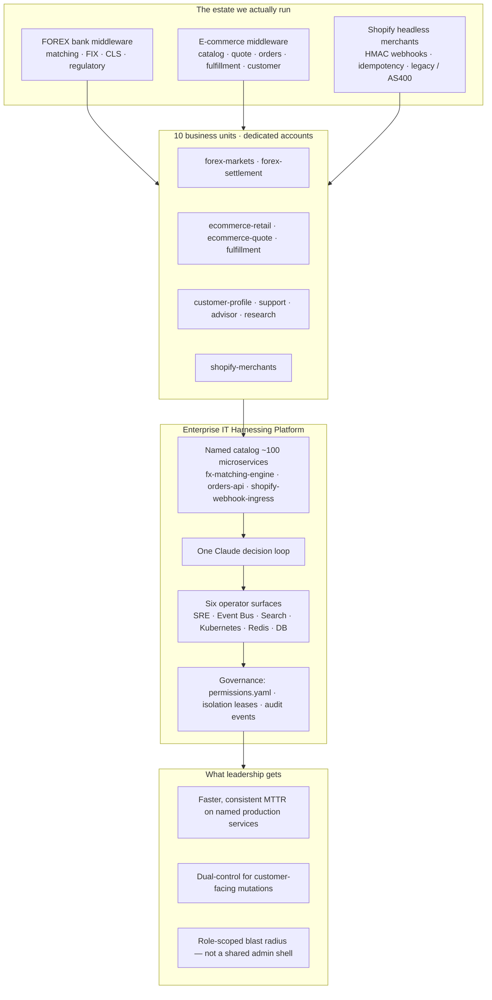

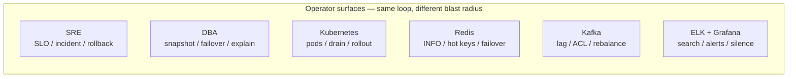

**Read this as a control model, not a chatbot.** Operators do not get a generic `bash` session against production. They get a catalog of **named** services (`fx-matching-engine`, not `service-1`), a permission file that **denies** irreversible wipes, and a lease so two agents cannot mutate the same cluster, topic, or cache at once.

---

## Enterprise architecture (100+ microservices)

The catalog in `enterprise_it_harnessing/catalog.py` is ten services per business unit. Domains roll up as **20 + 70 + 10 = 100**. Each unit also owns a dedicated Kubernetes cluster, bus, Redis, database, and ELK/Grafana stack — that data plane is why the estate is described as **100+**.

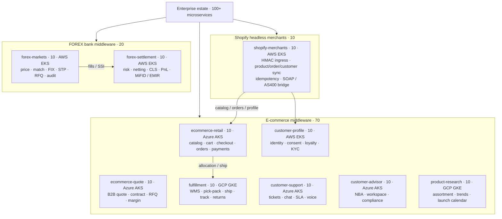

| Domain | Business units | Services | Sum |
| --- | --- | --- | --- |
| FOREX bank middleware | `forex-markets`, `forex-settlement` | 10 + 10 | **20** |
| E-commerce middleware | retail, quote, fulfillment, profile, support, advisor, research | 10 × 7 | **70** |
| Shopify headless merchants | `shopify-merchants` | 10 | **10** |
| **Enterprise** | **10 BUs** | | **100+** |

### Platform plane under those 100 services

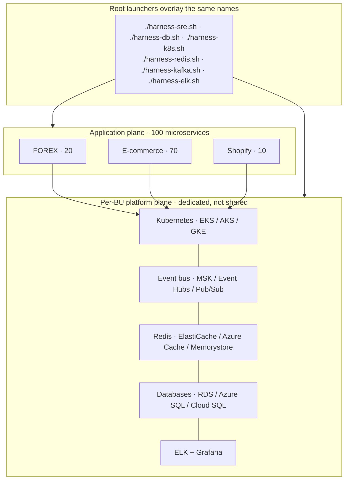

Dump the rollup from the repo root (no model): `./harness-sre.sh list-units`.

---

## Architecture (Engineering Manager & Chief Architect)

The platform is a **harness**, not an agent framework. The model decides. The harness executes, constrains, and names the world. The [enterprise architecture](#enterprise-architecture-100-microservices) above is the estate those tools resolve — FOREX (20) + e-commerce (70) + Shopify (10) = **100+** named microservices on dedicated per-BU platforms.

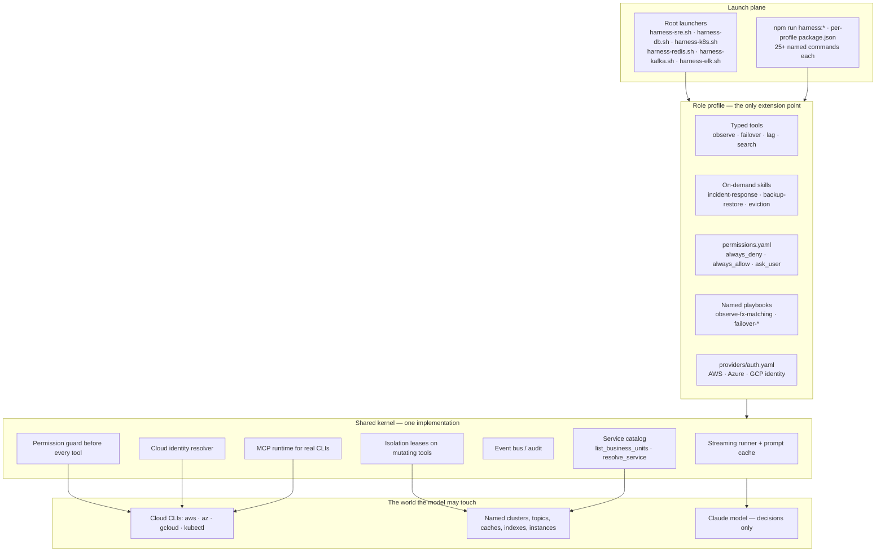

### Control-plane contract

| Layer | What it owns | What it must not own |
| --- | --- | --- |
| Model | Which tool to call, in what order, when to stop | Branching logic, raw shell interpolation, implicit prod access |
| Profile | Tool list, skills, deny/ask rules, named playbooks | A second agent framework |
| Shared kernel | Guard, leases, identity, catalog, events, MCP | Domain runbooks or BU-specific resource names |
| Catalog | 10 BUs, ~100 services, dedicated accounts/clusters | Guessed hostnames or “cluster-1” |

Catalog dumps (`list-units`, `resolve-*`) use `--tool` and **do not** call the model. Playbooks (`observe-*`, `incident-*`, `failover-*`) use `--once` and do.

Mutations fail closed: a dirty or already-leased target is refused. Leases live under `.harness_isolation/` (gitignored).

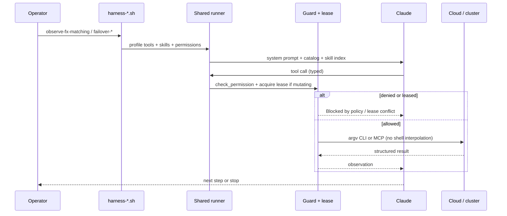

---

## Role-specific diagrams

Each role keeps the same loop and the same catalog. The **smallest** tool set that role needs is what gets registered. Cloud (AWS / Azure / GCP) only changes identity and CLI argv.

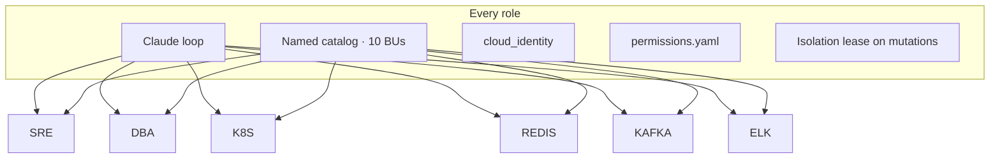

### SRE

**When:** microservice SLO — FOREX matching / FIX, checkout saga, Shopify HMAC ingress, support tickets.

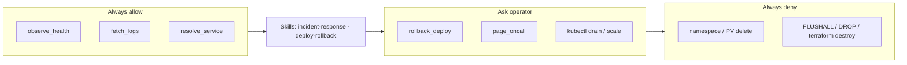

Launch: [`./harness-sre.sh`](../harness-sre.sh) · commands: [`enterprise_it_harnessing/sre.md`](../enterprise_it_harnessing/sre.md)

### Database administrator

**When:** RDS / Aurora / Azure SQL / Cloud SQL / Spanner — snapshot, failover, parameter group, slow-query explain. Never raw `DROP` in production.

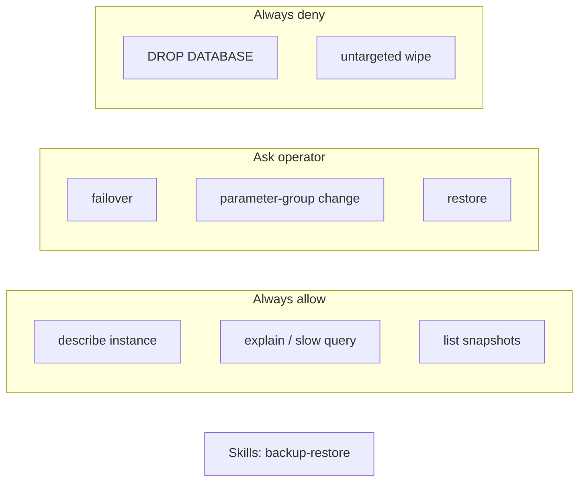

Launch: [`./harness-db.sh`](../harness-db.sh) · commands: [`enterprise_it_harnessing/db.md`](../enterprise_it_harnessing/db.md)

### Kubernetes cluster admin

**When:** EKS / AKS / GKE / on-prem kubeconfig. Read-only `get` / `describe` is open. Drain, cordon, delete, and rollout undo require an operator.

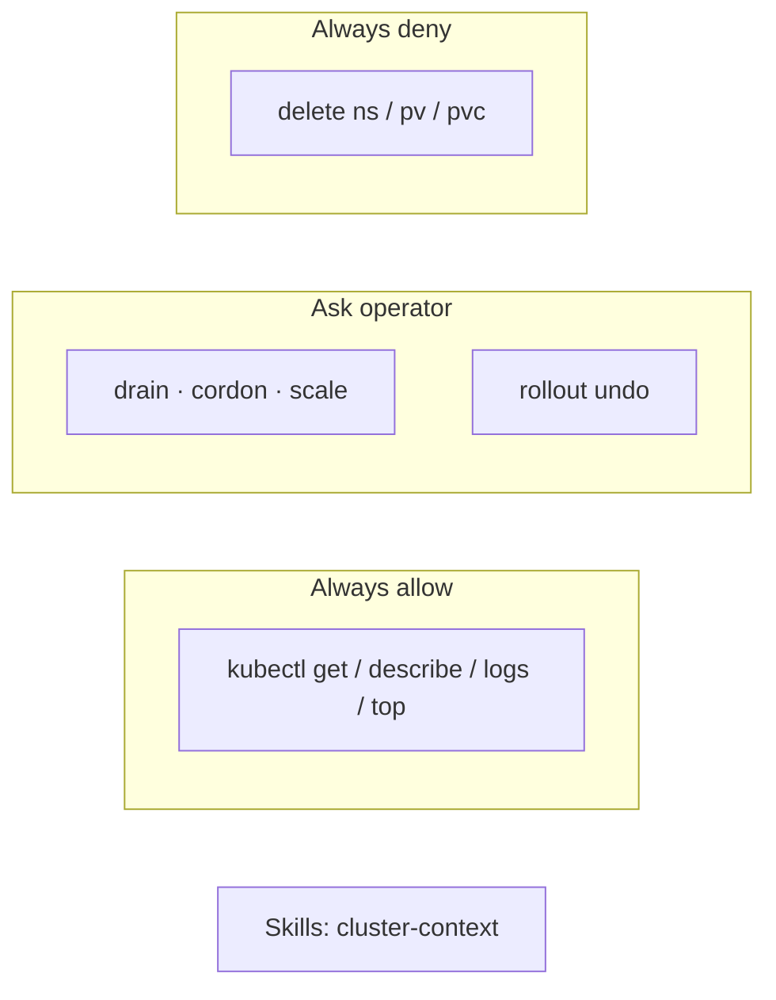

Launch: [`./harness-k8s.sh`](../harness-k8s.sh) · commands: [`enterprise_it_harnessing/k8s.md`](../enterprise_it_harnessing/k8s.md)

### Redis admin

**When:** ElastiCache / Azure Cache / Memorystore — `INFO`, slowlog, replica lag, eviction storms, hot keys. `FLUSHALL` is denied in production.

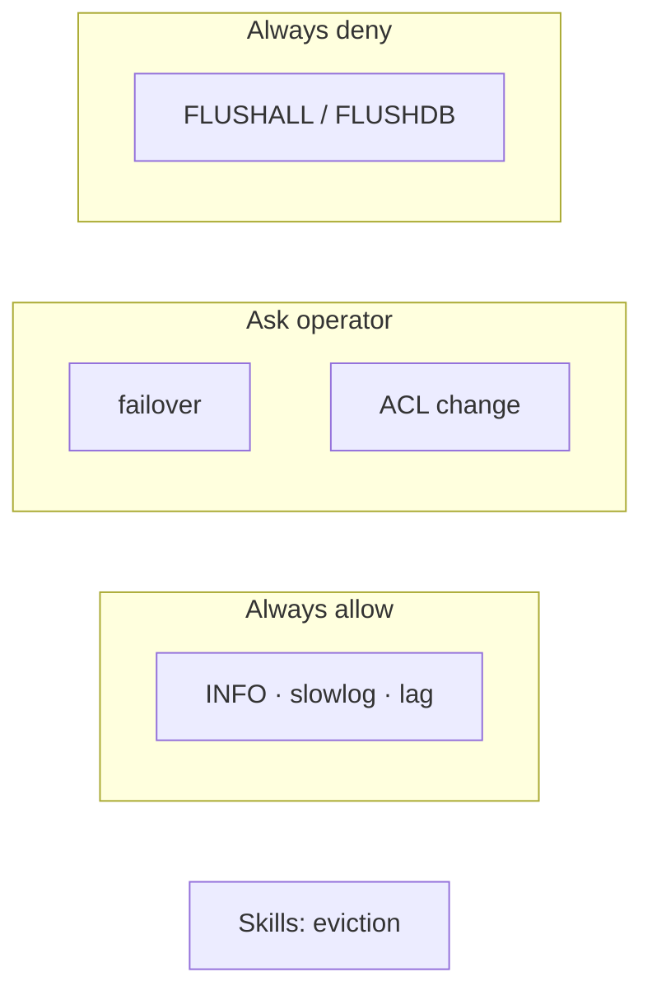

Launch: [`./harness-redis.sh`](../harness-redis.sh) · commands: [`enterprise_it_harnessing/redis.md`](../enterprise_it_harnessing/redis.md)

### Kafka / bus admin

**When:** MSK / Event Hubs / Pub/Sub — consumer lag, ACLs, poison-pill recovery, long rebalances as background work.

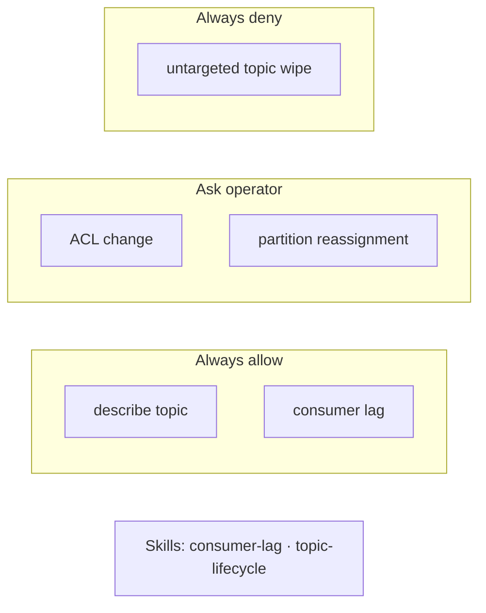

Launch: [`./harness-kafka.sh`](../harness-kafka.sh) · commands: [`enterprise_it_harnessing/kafka.md`](../enterprise_it_harnessing/kafka.md)

### ELK + Grafana

**When:** Elasticsearch aliases (`forex-trades`, `shopify-webhooks`, `orders`) and Grafana folders per business unit. Silences require approval.

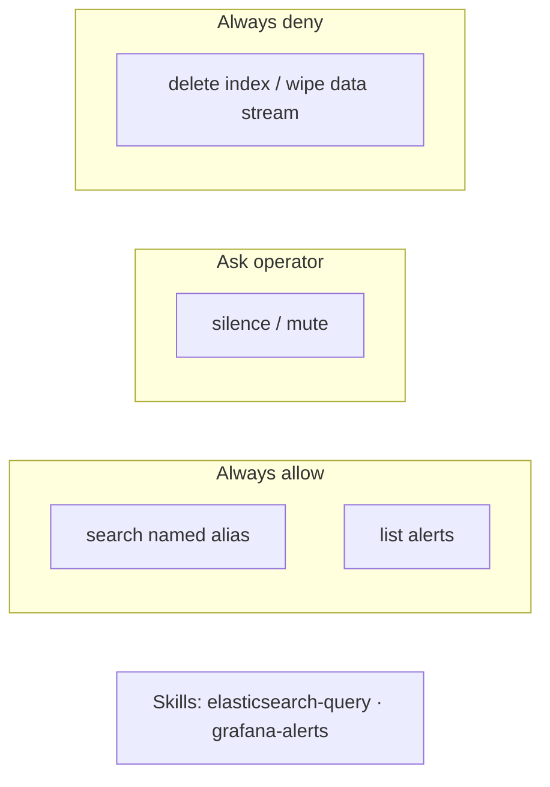

Launch: [`./harness-elk.sh`](../harness-elk.sh) · commands: [`enterprise_it_harnessing/elk.md`](../enterprise_it_harnessing/elk.md)
